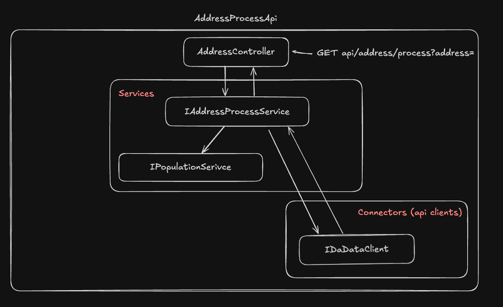

# TestTaskDaData

TestTaskDaData — сервис стандартизации адреса с помощью API DaData Clean

## Основные требования

- [x] Реализован GET endpoint, принимает адрес, возвращает стандартные поля из ТЗ + доп. поле
- [x] ASP.NET Core WebApi
- [x] Automapper, Swagger, логирование Serilog, политика CORS, использование IOptions, Dependency Injection, IHttpFactory
- [x] Обработка Exception происходит через Middleware 
- [x] Не используются сторонние пакеты для работы с DaData

## Дополнительно

Вне требований ТЗ реализована функция рассчета предполагаемого кол-ва жителей в доме

Для рассчета используется поле ответа DaData - house_flat_count и ответ сервиса IPopulationService (используется заглушка, по необходимости можно легко внедрить реальную реализацию)


## Архитектура



## Структура проекта

- **Api**  
  *Реализация и обеспечение работы API*  
  &nbsp;&nbsp;&bull; **Controllers** – Контроллеры для обработки HTTP-запросов.  
  &nbsp;&nbsp;&bull; **Middlewares** – Промежуточная обработка запросов.

- **Connectors**  
  *Реализация клиентов для обращения к сторонним сервисам*  
  &nbsp;&nbsp;&bull; **DaData** – Клиент для запроса к сервису DaData.

- **Services**  
  *Бизнес-логика приложения*  
  &nbsp;&nbsp;&bull; **AddressProcessService** – Сервис для обработки адреса согласно ТЗ.  
  &nbsp;&nbsp;&bull; **PopulationService** – Сервис для расчёта приблизительного количества жителей на квартиру.

- **Shared**  
  *Общий код, используемый в разных частях приложения*  
  &nbsp;&nbsp;&bull; **Mappings** – Профили для маппинга классов.  
  &nbsp;&nbsp;&bull; **Models** – Модели данных.

## Установка и запуск

### Необходимо

- [Docker](https://www.docker.com/get-started)

### Шаг 1. Клонирование репозитория

```bash
git clone https://github.com/KonstantinPolyanskiy/TestTaskDaData.git
```

### Шаг 2. Запуск docker образа

```bash
cd TestTaskDaData/TestTaskDaData.AddressProcessApi
```

```bash
docker build -t testtaskdadata . &&
docker run -d -rm \
  -e ASPNETCORE_URLS="http://+:8080" \
  -e DaDataOptions__Token="token_example" \
  -e DaDataOptions__Secret="secret_example" \
  -p 8080:8080 \
  --name process_address_service \
  testtaskdadata
```

## Пример запроса

### Обработка адреса

```bash
http://localhost:8080/api/address/process?address=мск%20сухонска%2011/-89
```

### Swagger

```bash
http://localhost:5122/swagger/index.html
```